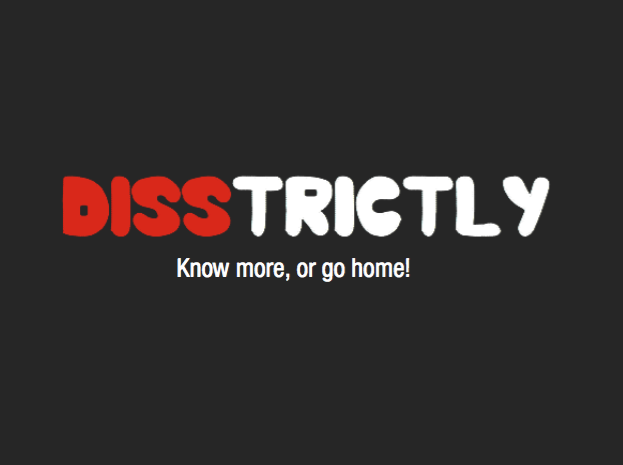

Disstrictly
---------

Disstrictly is a hyperlocal, multi-medial and highly disruptive online-game for Berlin Hipsters. In a playful way we test how good you really know your neighborhood by showing you Eyeem-photos and SoundCloud-sounds recorded in your neighborhood vs. those from other areas of the city. If you guess which ones were taken in your hood, you are the ultimate Berlin-Pro. Show us how much of a local you really are.

Click to see a demo: 

Team
--------
Disstrictly was created in 24 hours during the Berlin Geekettes Hackathon in October 2013, in collaboration with @sweetdakini
and @anderspree

## Setup

Simply start the web server on port 8000:

./run
